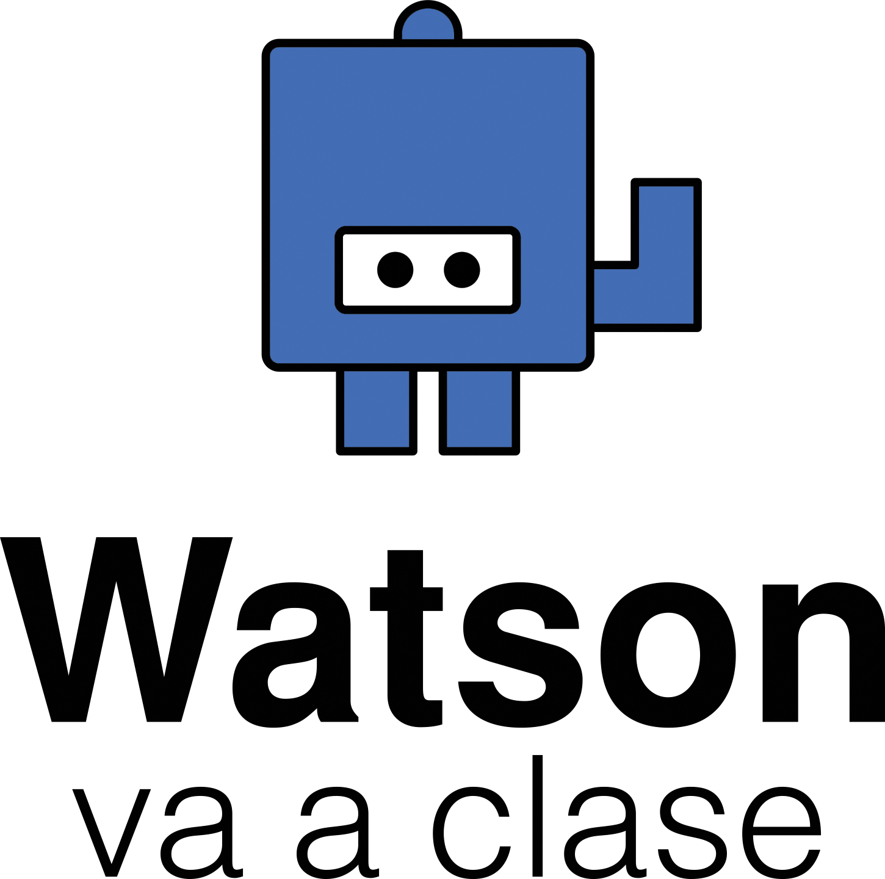

# Watson va a Clase
## Un programa para aprender INTELIGENCIA ARTIFICIAL

 

### TEMARIO

### Tema 1: IBM Cloud
		- Introducción a IBM Cloud y a la Inteligencia Artificial
		- IBM Watson
		- Cómo crear una cuenta en IBM CLoud
		- Primeros pasos
		

### Tema 2: Node-RED
		- Qué es Node-RED
		- Cómo crear un proyecto
		- Ejercicio 1: Hola Mundo
		- Ejercicio 2: Traductor
		- Ejercicio 3: Incorporación de Funciones y Nodos
		- Ejercicio 4: Reconocimiento Visual y de Texto con Watson
		- Ejercicio 5: Desarrollo página Web con Node Red
		

### Tema 3: Creación de un Chatbot con Watson Assistant
		- Servicios de Watson
		- Watson Assistant
			- Intents
			- Entities
			- Dialog
		
### Tema 4: Creación de un chatbot con Telegram
		- Cómo funciona Telegram
		- Desarrollo en Node-RED

### Tema 5: TJBot virtual en Node-RED
		- Servicios de Watson
			- Text to speech
			- Speech to text
			- Assistant
			- Tone Analyze
			- Translator
		- Combinar TJBot virtual con dispositivos externos
			- Cámara
			- Micrófono
			- Altavoz
		- Probando y entrenando a TJBot Virtual

### Tema 6: Desarrollo web
		- HTML
			- Primera página web
			- Añadir imágenes
		- CSS
		- Crear una Web en Node-RED
	

